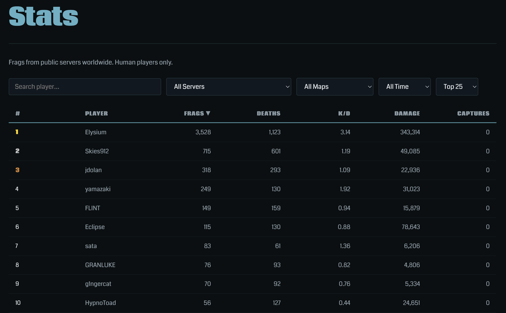
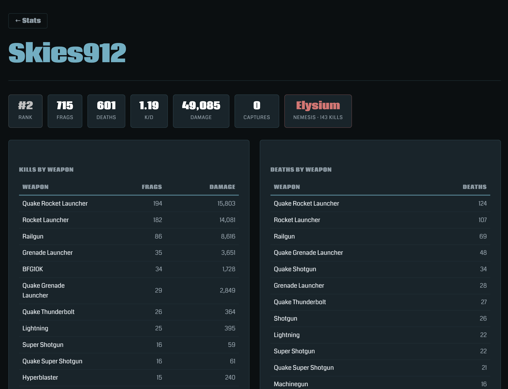

May 28, 2026

# 💀 Stats Are Here

You've been fragging. We've been counting. Head over to [Stats](/stats/) to see where you stand.

### Global leaderboard

Every frag on every public Quetoo server is recorded and ranked. Filter by server, map, or time window — or just stare at the top of the list and feel bad about yourself.

The leaderboard tracks frags, deaths, K/D ratio, total damage dealt, and CTF flag captures. Click any column header to re-sort. Click any player row to dive into their full breakdown.

### Player deep-stats

Curious how you stack up weapon by weapon? Every player page shows kills and damage by weapon, deaths by weapon, and — most importantly — your **nemesis**: the player who has fragged you the most.

### How it works

Stats are captured live from public servers and posted to [giblets.quetoo.org](https://giblets.quetoo.org) after each match. Your in-game name and a privacy-preserving identifier are all that's stored — no account required. Just frag.

Jump in, check the [leaderboard](/stats/), and start climbing. 🏆

